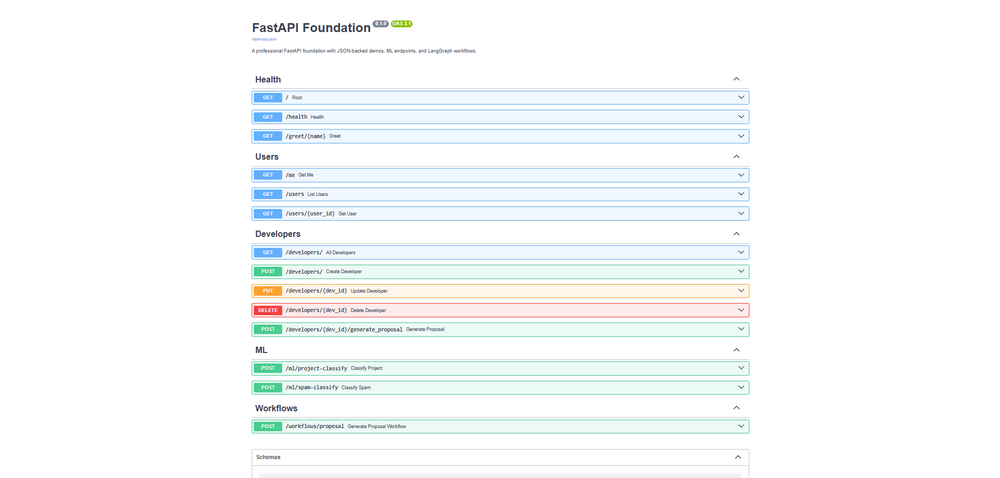

# FastAPI Foundation

This repository is a cleaned-up FastAPI workspace that combines REST API patterns,
JSON-backed CRUD examples, LangGraph workflows, and lightweight ML inference
endpoints.

## Highlights

- Professional FastAPI app structure with reusable routers and services.
- JSON-backed user and developer records.
- Project classification and spam detection inference endpoints.
- LangGraph proposal workflow and local Ollama-based proposal generation.
- Clear separation between the app package and legacy example scripts.

## Repository Layout

- `app/` - FastAPI application package, routers, schemas, and services.
- `examples/` - legacy/demo scripts kept as examples instead of app entry points.
- `data/` - JSON data and model artifacts used by the demos.
- `models/` - optional location for trained weights and serialized estimators.
- `scripts/` - helper scripts for training or maintenance.

The repo root is intentionally kept small; the older one-file demos now live in
`examples/`, while the main application lives in `app/`.

## Quick Start

1. Create a virtual environment and install dependencies.

```bash
python -m venv .venv
.venv\Scripts\activate    # Windows PowerShell
pip install --upgrade pip
pip install -r requirements.txt
```

2. Run the API.

```bash
uvicorn main:app --reload
```

3. Open the docs.

- Swagger UI: <http://127.0.0.1:8000/docs>
- ReDoc: <http://127.0.0.1:8000/redoc>

## Core Endpoints



- `GET /` - health-style landing page.
- `GET /users` - list users from `me.json`.
- `GET /developers` - list developers from `developers.json`.
- `POST /ml/project-classify` - classify project descriptions.
- `POST /ml/spam-classify` - classify SMS text.
- `POST /llm/proposal/{dev_id}` - generate a proposal from a developer profile.
- `POST /workflows/proposal` - LangGraph-based draft/critique/finalize workflow.

## Notes

- If the local ML artifacts are missing, the app returns a clear `503` response.
- For Ollama-based routes, set the required environment variables in `.env`.
- Keep large artifacts out of Git and document them in `data/` or `models/`.
